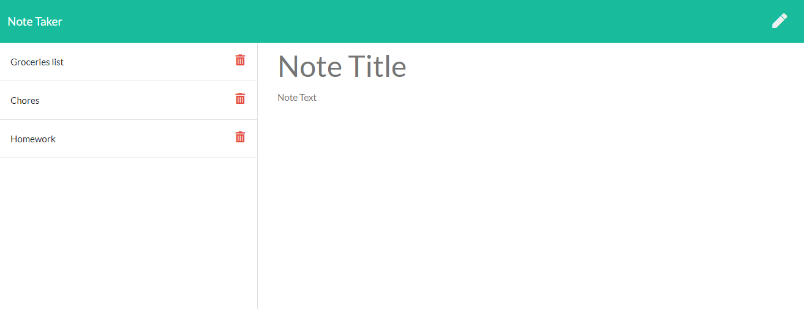

# Note Taker
Project realized for UC Berkeley Extension Coding Bootcamp




## Technologies Used
 &nbsp;
 &nbsp;
 &nbsp;
 &nbsp;

- HTML
- CSS
- JavaScript
- [Node.js](https://nodejs.org/en/)
- npm packages:
    - [Express](https://www.npmjs.com/package/express)
    - [fs](https://www.npmjs.com/package/fs)

<br>
<hr>

## Summary 
This App allows you to write, save, and delete note efficiently.
The notes are consistant and stored on your local machine for full privacy.

<br>
<hr>

## How to install
Download the project on your local machine.
Make sure you have node installed then at the root of the folder run the command:

```
npm install
```

<br>
<hr>

## How to use it
run the commande 

```
node server.js
```
then visit: **http://localhost:3000/**

<br>
<hr>

## Code Snippet 
```js
app.delete('/api/notes/:id', (req, res) => {
  var deletion = req.params.id
  for(var i = 0; i < notes.length; i++) {
      if(deletion == notes[i].id) {
        notes.splice(i, 1);
        break;
      }
      
  }
  fs.writeFile(path.join(__dirname, 'db/db.json'), JSON.stringify(notes), err => { });
  res.redirect('/notes');
});
```
In this example, I used the splice method to delete the selected note from the JSON object, then stringify it and save it inside the db.json file using fs.

<br>
<hr>

## Result Example
[Link](https://dylancouzon.github.io/Team_Profile_Generator/dist/Dylan.html)

<br>
<hr>

## Author
- [dylancouzon@gmail.com](mailto:dylancouzon@gmail.com)
- [GitHub](https://github.com/Dylancouzon)
- [LinkedIn](https://www.linkedin.com/in/dcouzon/)

